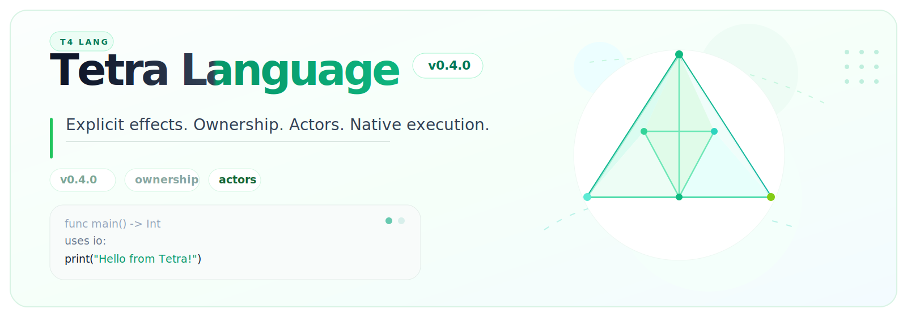

<p align="center">
  
</p>

# Tetra Language (v0.4.0)

<p align="center">
  
  
  
  
</p>

> <span style="color:#059669"><strong>A green-path systems language</strong></span>
> for explicit effects, ownership-aware memory, actor/task concurrency, and
> native execution. Current line: <span style="color:#10b981"><strong>v0.4.0</strong></span>.
> Future line: <span style="color:#f59e0b"><strong>v1.0.0</strong></span>.

Tetra is being built around a small rule: **make the compiler-visible truth
reviewable**. Effects are written down, memory evidence is projected from
compiler-owned facts, and target/runtime claims stay narrow until gates prove
them.

```tetra
func greeting() -> String:
    return "Hello from Tetra!\n"

func main() -> Int
uses io:
    print(greeting())
    return 0
```

---

## Shape

<p>
  <span style="color:#059669"><strong>Checked surface.</strong></span>
  <span style="color:#334155">Tetra is usable today as a local compiler/tooling profile, not as a broad v1 promise.</span>
</p>

| Part | Tetra shape |
| --- | --- |
| Functions | `func name(args) -> Type:` |
| Effects | `uses io`, explicit capability-style boundaries |
| Memory | ownership, borrow, consume, `inout`, conservative unsafe edges |
| Concurrency | async, task, and actor model |
| Source | `.t4` first; legacy `.tetra` examples still run |
| Current profile | `v0.4.0`; `v1.0.0` is future |
| Main target line | `linux-x64` production baseline; other targets are gated by evidence |
| Proof style | validators, reports, smoke artifacts, and explicit nonclaims |

---

## Try it

<p>
  <span style="color:#0ea5e9"><strong>Fast path.</strong></span>
  Bootstrap the CLI, check the canonical Flow example, then run it.
</p>

```sh
bash scripts/dev/bootstrap.sh
./tetra check examples/flow_hello.tetra
./tetra run examples/flow_hello.tetra
```

Expected output:

```text
Hello from Flow!
```

---

## Install

Linux x64 release installer:

```sh
curl -fsSL https://github.com/BoSuY0/Tetra_Language/releases/download/v0.4.0/install.sh | bash
tetra version
```

Container package:

```sh
docker run --rm ghcr.io/bosuy0/tetra-language:0.4.0 tetra version
```

Homebrew tap:

```sh
brew tap BoSuY0/tetra
brew install tetra
tetra version
```

The binary release baseline is `linux-x64`. Other target/runtime claims remain
gated by the evidence named in the release docs. Private release downloads need
a GitHub token; see `docs/user/install.md`.

---

## Syntax at a glance

```tetra
func double(x: Int) -> Int:
    return x * 2

func main() -> Int
uses io:
    let value: Int = double(21)
    print("value = 42\n")
    return value
```

---

## What is current now

| Area | Current truth |
| --- | --- |
| Compiler profile | `v0.4.0` local compiler/tooling profile |
| Release truth | `docs/spec/current_supported_surface.md` |
| CLI workflow | `check`, `build`, `run`, `fmt`, `test`, `doc`, `doctor`, `targets`, `features`, `formats`, `lsp`, `workspace`, `smoke`, `eco` |
| Memory evidence | `MemoryFactGraph`, `tetra.memory-report.v1`, and `tetra.memory-fuzz.oracle.v1` evidence; no broad "Memory 100%" claim |
| Async/tasks/actors | current local async/task/actor behavior with explicit support boundaries |
| Targets | `linux-x64` is the production Linux baseline; macOS/Windows are build-only unless target evidence says otherwise |
| Standard library | release-covered `lib.core.*` helpers plus explicit experimental surfaces |

---

## Docs

| Topic | File |
| --- | --- |
| Language tour | `docs/user/language_tour.md` |
| Install | `docs/user/install.md` |
| Flow syntax | `docs/spec/flow_syntax_v1.md` |
| Ownership/effects | `docs/user/ownership_effects_guide.md` |
| Async/actors | `docs/user/async_actors_guide.md` |
| Standard library | `docs/user/standard_library_guide.md` |
| Examples | `docs/user/examples_index.md` |
| Current surface | `docs/spec/current_supported_surface.md` |
| Release gate | `scripts/release/v0_4_0/gate.sh` |
| v1.0 scope | `docs/spec/v1_scope.md` |

---

## Roadmap, concretely

<div style="border:1px solid #bbf7d0; border-left:8px solid #10b981; background:#f0fdf4; padding:18px 22px; border-radius:14px; margin:14px 0 22px;">
  <p style="margin:0 0 10px 0; font-size:18px;">
    <span style="color:#047857"><strong>Roadmap focus:</strong></span>
    make the current surface sharper, then promote only slices backed by tests,
    validators, reports, and release artifacts.
  </p>
  <p style="margin:0;">
    <span style="color:#10b981"><strong>Near term:</strong></span>
    harden what is already current.
    <span style="color:#f59e0b"><strong>Next:</strong></span>
    grow evidence-backed language/runtime slices.
    <span style="color:#ef4444"><strong>Not yet:</strong></span>
    avoid v1-style overclaims until gates pass.
  </p>
</div>

<table>
  <thead>
    <tr>
      <th align="left">Track</th>
      <th align="left">Concrete next direction</th>
      <th align="left">Gate before claim</th>
    </tr>
  </thead>
  <tbody>
    <tr>
      <td><span style="color:#0369a1"><strong>Syntax</strong></span></td>
      <td>Keep <code>T4</code> / Flow indentation as the primary source shape; keep legacy <code>.tetra</code> examples running.</td>
      <td><span style="color:#0f766e"><strong>Flow-only validation</strong></span> plus docs/examples smoke.</td>
    </tr>
    <tr>
      <td><span style="color:#7c3aed"><strong>Types</strong></span></td>
      <td>Grow constrained generic functions, static protocol conformance, enums, optionals, extensions, and modules.</td>
      <td><code>go test ./compiler/... -run 'Type|Inference|Enum|Optional|Protocol|Extension|Module|Generic|Conformance' -count=1</code></td>
    </tr>
    <tr>
      <td><span style="color:#059669"><strong>Memory</strong></span></td>
      <td>Keep ownership/borrow/unsafe facts compiler-owned; continue narrow slices like bounds, FFI, storage, async, dynproto, and fuzz oracle evidence.</td>
      <td><span style="color:#047857"><strong>memory report/fuzz validators</strong></span> plus focused compiler gates.</td>
    </tr>
    <tr>
      <td><span style="color:#c2410c"><strong>Async/tasks/actors</strong></span></td>
      <td>Harden cooperative task handles, task-group cancellation, actor mailbox behavior, and Linux-x64 distributed actor evidence without claiming full structured concurrency.</td>
      <td>async/task/actor compiler tests plus smoke artifacts.</td>
    </tr>
    <tr>
      <td><span style="color:#0891b2"><strong>Standard library</strong></span></td>
      <td>Expand practical <code>lib.core.*</code> helpers for IO, memory, collections, filesystem, net, HTTP, JSON, PostgreSQL wire frames, time, sync, and async.</td>
      <td>stdlib docs, smoke examples, API docs validation.</td>
    </tr>
    <tr>
      <td><span style="color:#2563eb"><strong>Targets</strong></span></td>
      <td>Keep <code>linux-x64</code> as the production baseline; promote linux-x86/x32, macOS, Windows, WASI, and Web only with target-specific build/runtime evidence.</td>
      <td>target smoke reports and <code>validate-linux-native-targets</code> / release validators.</td>
    </tr>
    <tr>
      <td><span style="color:#334155"><strong>Tooling</strong></span></td>
      <td>Keep CLI, LSP, JSON diagnostics, reports, manifests, and release gates boring and reproducible.</td>
      <td><code>go test ./cli/... ./tools/... -count=1</code> plus manifest/docs validators.</td>
    </tr>
    <tr>
      <td><span style="color:#e11d48"><strong>v1.0</strong></span></td>
      <td>Treat <code>v1.0.0</code> as future until version preflight, safety closure, runtime/backend/target gates, docs, and handoff evidence are fresh.</td>
      <td><code>scripts/release/v1_0/gate.sh</code> after version promotion.</td>
    </tr>
  </tbody>
</table>

### Non-goals until proven

<div style="border:1px solid #fecaca; border-left:8px solid #ef4444; background:#fff1f2; padding:16px 20px; border-radius:14px; margin:14px 0 20px;">
  <p style="margin:0 0 8px 0;">
    <span style="color:#dc2626"><strong>Do not claim yet:</strong></span>
  </p>
  <ul style="margin-top:0; margin-bottom:0;">
    <li>no broad memory-safety or <strong>"Memory 100%"</strong> claim;</li>
    <li>no arbitrary unsafe pointer safety claim;</li>
    <li>no C++/Rust performance or parity claim;</li>
    <li>no full async lifetime or structured concurrency proof;</li>
    <li>no cross-target runtime claim without target-specific evidence;</li>
    <li>no <code>v1.0.0</code> claim while the repo remains on <code>v0.4.0</code>.</li>
  </ul>
</div>

---

## Current line

<p>
  <span style="color:#10b981"><strong>Tetra is currently v0.4.0.</strong></span>
  <span style="color:#64748b">The public truth lives in checked docs, validators, and release artifacts.</span>
</p>

`v1.0.0` is future.
