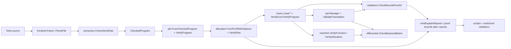
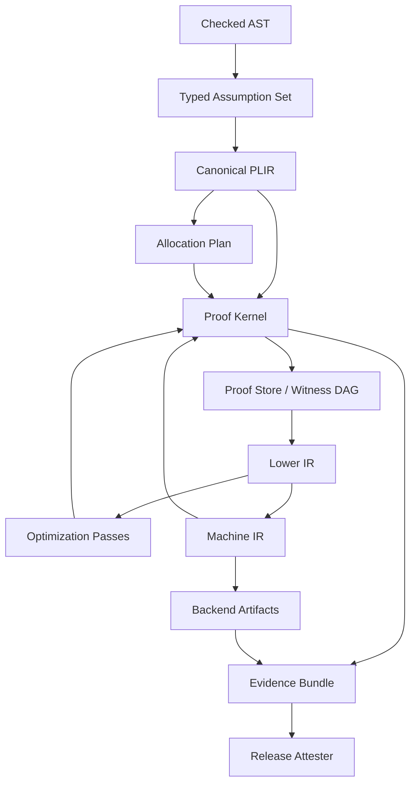

# Tetra Compiler Proof + Validation Audit

Дата аудиту: 2026-06-03  
Фокус: Compiler "перевірочна магія" / proof + validation  
Роль: критик архітектури мов програмування, з пріоритетом на реальні гарантії, межі доказовості, місця самообману й ідеальну цільову модель.

## 1. Виконавчий вердикт

У проекті вже є не декоративна, а реальна validation-архітектура: semantic checking, PLIR verification, stack IR verification, allocation-plan validation, bounds-proof reports, optimization translation validation, machine IR verifier, differential backend matrix і release validators. Це сильна база.

Але поточна система ще не є "ідеальною proof architecture". Вона радше є набором локальних, частково формалізованих контрактів між стадіями. Її сильна сторона - багато негативних тестів і кілька незалежних gates. Її слабка сторона - proof-логіка розсіяна між `semantics`, `plir`, `lower`, `validation`, `opt`, `reports`, scripts/tools validators, а частина "proof" перевіряє наявність proof id, guard dominance і структурну узгодженість, але не завжди повну семантичну істинність факту.

Моя оцінка: це добра engineering validation lattice, але ще не compiler proof kernel. Для мови, яка претендує на сильні safety/ownership/bounds гарантії, наступний рівень - централізований typed proof pipeline, один canonical proof store, machine-checkable evidence для кожної трансформації, proof-aware fuzzing і незалежний producer/attester/verifier ланцюг для release evidence.

## 2. Метод аудиту і межі

Я почав з Graphify MCP, як вимагає `AGENTS.md`: пройшов graph queries, god nodes, neighbors і shortest paths для `ValidateTranslation()`, `ValidateAllocationLowering()`, `VerifyFunc()`, `CheckBoundsProofs()`, `BuildFileWithStatsOpt()`, `LowerWithOptions()` та пов'язаних вузлів. Потім перевірив конкретні файли через `rg`, `nl -ba`, `sed`, щоб не покладатися тільки на graph report.

Також залучено три read-only sub-agent зрізи:

- Kuhn: compiler internals і proof-critical pipeline.
- Pascal: scripts/tools validators/release gates.
- Euclid: test coverage і blind spots.

Цей документ є повним архітектурним аудитом proof-critical поверхні. Він не стверджує, що фізично процитовано кожен рядок усього репозиторію; натомість пройдено всі ключові вузли, методи, gates і тестові артефакти, які формують claims "compiler proof + validation".

## 3. System Map: де народжується і перевіряється гарантія

Поточний pipeline виглядає так:



Публічні API це підтверджують: `compiler/api.go:48-120` дає `Parse`, `ParseFile`, `Check`, `CheckWorldOpt`, `Lower`, `BuildPLIR`, `LowerModule`, `VerifyIRProgram`, `VerifyIRFunc`. Уже на API-рівні видно, що verification є не одним етапом, а набором окремих entrypoints.

`BuildFileWithStatsOpt` у `compiler/compiler.go:138-184` завантажує checked world, перевіряє exported FFI ABI, runtime до codegen, будує native module plan, компілює, лінкує і емітить explain reports. Важливо: це production compile entrypoint, тому саме тут має бути найсильніший validation contract.

`compileNativeModulePlan` у `compiler/compiler.go:490-610` для target-supported stack allocation будує PLIR, allocation plan, lowering, перевіряє target atomics, викликає `validation.ValidateAllocationLowering` і лише тоді йде в backend codegen. Це хороший gate.

Проблема: інший object path у `compiler/compiler.go:1355-1435` робить `CheckWorldOpt`, FFI ABI validation, `LowerModule`, target atomic IR validation і object codegen, але в оглянутому фрагменті не видно симетричного `ValidateAllocationLowering`. Для ідеальної архітектури всі compile/output entrypoints мають проходити однаковий proof/validation contract або явно декларувати, чому він не застосовується.

## 4. Semantic layer: що вже добре

Semantic layer створює foundation для proof. `CheckedProgram`, `CheckedFunc`, `LocalInfo` і callable escape metadata визначені у `compiler/internal/semantics/types.go:11-117`. `CheckWorldOpt` у `compiler/internal/semantics/checker.go:771-823` збирає world, нормалізує generics, перевіряє base types і module graph.

Стан ownership/region/resource зібраний у `compiler/internal/semantics/region.go:95-154`; це правильний напрям, бо proof про bounds і allocation без region/escape моделі швидко стає фальшивим. `checkStmts` у `compiler/internal/semantics/checker.go:10472-10640` тримає важливі safety-контракти: effects, privacy on print, `free` тільки в unsafe context, resource finalization/provenance, return closure validation.

Escape для callable values класифікується в `compiler/internal/semantics/callable_escape.go:17-51`: ephemeral surface captures, mutable/resource captures і escaping function values отримують окрему політику. Це важливо для downstream allocation proof.

Критика: semantic layer має багато safety facts, але вони не всі стають єдиним typed proof artifact. Частина фактів живе як checked metadata, частина як PLIR facts, частина як lowering-time state. Ідеально semantic stage має не тільки відхиляти помилки, а й продукувати підписаний набір typed assumptions для proof kernel.

## 5. PLIR: найважливіший proof-bearing шар

PLIR вже має правильні абстракції:

- `ProofGuard`, `ProofUse`, `RangeFact`, `Fact` у `compiler/internal/plir/plir.go:160-188` і `compiler/internal/plir/plir.go:301-311`.
- `FromCheckedProgram` у `compiler/internal/plir/plir.go:313-344`.
- `attachProofUses` у `compiler/internal/plir/plir.go:1794-1805`, який зв'язує uses з guards за `ProofID`.
- range proof state, invalidation і active proof lookup у `compiler/internal/plir/plir.go:1807-1990`.
- `addRangeProof` у `compiler/internal/plir/plir.go:1991-2021`, який одночасно додає `FactIndexInRange`, `ProofGuard` і `RangeFact`.

PLIR verifier також не декоративний:

- `VerifyProgram` у `compiler/internal/plir/verify.go:8-26` ловить duplicate funcs.
- `VerifyFunction` у `compiler/internal/plir/verify.go:28-173` перевіряє value metadata, alloc intent guards, CFG, proof wiring, range facts, consistency.
- `verifyProofWiring` у `compiler/internal/plir/verify.go:225-268` вимагає, щоб proof guards мали відомі blocks/ops, proof uses посилалися на відомі blocks/ops, а guard block домінував use block.
- `compiler/internal/plir/cfg.go:19-25` визначає `Dominates`, а `compiler/internal/plir/cfg.go:27-78` рахує dominators.

Це сильний дизайн: proof не просто string tag, він має CFG-домінування. Але proof still shallow щодо семантичного змісту guard-а. Dominance каже "guard стоїть раніше на всіх шляхах", а не "guard справді доводить саме цей index in range після всіх alias/mutation effects".

## 6. Range proof: де сильна сторона і де межа

У lower layer proof generation повторює PLIR-подібну логіку. `whileRangeProof` у `compiler/internal/lower/lower.go:5720-5740` приймає тільки вузький патерн: condition, zero local, unit increment, no external/invalid slice. `ifRangeProof` у `compiler/internal/lower/lower.go:5742-5759` робить branch proof. Invalidation через mutation/inout є в `compiler/internal/lower/lower.go:5769-5793`; активний proof для index lookup - `compiler/internal/lower/lower.go:5803-5816`.

PLIR має аналогічний контур: `whileRangeProof` у `compiler/internal/plir/plir.go:2226-2243`, `ifRangeProof` у `compiler/internal/plir/plir.go:2245-2259`, `rangeProofFromCondition` у `compiler/internal/plir/plir.go:2261-2289`, `branchRangeProofFromCondition` у `compiler/internal/plir/plir.go:2291-2313`, upper-bound extraction у `compiler/internal/plir/plir.go:2344-2380`.

Арифметична основа винесена в `compiler/internal/rangeproof/rangeproof.go:8-231`: `Range`, `Bound`, `LessThanLen`, `LessEqualLenMinusOne`, `AddConst`, `SubConst`, `MinClamp`, `MaxClamp`, `Join`, `Widen`. Це добре, але це маленька range algebra, не theorem prover.

Найбільший ризик: range proof generation дублюється між `lower` і `plir`. Для компілятора це небезпечно: коли proof source і proof consumer мають схожі, але не єдині правила, з'являється drift. Ідеально має бути один proof constructor або один proof kernel API, через який і PLIR, і lowering отримують однакові typed proof terms.

## 7. Bounds validation: що саме доведено

`lower.VerifyFunc` у `compiler/internal/lower/verify.go:62-215` має критичний guard: unchecked index load без proof id відхиляється у `compiler/internal/lower/verify.go:139-142`. Це важливо: downstream IR не може тихо отримати unchecked bounds access без proof tag.

`validation.CheckBoundsProofs` у `compiler/internal/validation/validation.go:112-138` проходить IR і рахує removed checks: unchecked index load/store з `ProofID` стає `RemovedCheck`, checked load/store стає `ChecksLeft`. `CheckBoundsProofsWithPLIR` у `compiler/internal/validation/validation.go:140-169` додатково вимагає PLIR, проганяє `plir.VerifyProgram`, збирає proof guards і відхиляє removed check, якщо його proof id не має PLIR guard.

Це чесна гарантія:

- unchecked access мусить мати proof id;
- proof id мусить існувати в PLIR;
- PLIR verifier мусить прийняти proof wiring;
- dominance має бути перевірений у PLIR.

Але це не повна гарантія:

- `CheckBoundsProofs` записує facts як `index_in_range` і `len_stable`, але не виводить їх наново з AST/semantics;
- `CheckBoundsProofsWithPLIR` перевіряє присутність guard-а за id, але не зіставляє повний proof term із конкретним use site на рівні "цей індекс, ця база, ця довжина, цей alias state";
- якщо proof id і guard присутні, але semantic derivation була неправильно побудована upstream, цей gate може не зловити помилку.

Ідеальна вимога: кожен removed bounds check має посилатися не тільки на `ProofID`, а на typed proof term:

```text
RangeProof {
  subject: IndexExpr(base, index),
  lower: 0 <= index,
  upper: index < len(base),
  guard_origin: AST/PLIR op id,
  dominance: CFG proof,
  mutation_epoch: base/index epoch,
  alias_assumptions: set,
  invalidation_events: none between guard and use,
}
```

Verifier має заново перевіряти цей term проти PLIR facts, CFG і mutation/alias epochs.

## 8. Lower IR verifier: сильний structural gate

`compiler/internal/lower/verify.go:8-25` прямо документує invariant scope: main/function metadata, slot metadata, branch labels, stack height, local/global slots, return slots, calls/runtime, policy guards. `VerifyProgram` у `compiler/internal/lower/verify.go:26-60` перевіряє main, duplicate funcs, кожну func і known call signatures. `VerifyFunc` у `compiler/internal/lower/verify.go:62-215` перевіряє instruction kinds, branch labels, stack metadata, runtime ABI, policy guards, CFG stack height і linear stack.

Це правильний IR verifier. Він ловить структурну неконсистентність і частину safety metadata. Але structural verifier не заміняє semantic proof. Він може сказати "unchecked load має proof id", але не може самостійно сказати "proof id істинний".

## 9. Allocation validation: одна з найкращих частин системи

Allocation pipeline має хорошу форму:

- `allocplan.FromPLIRWithOptions` у `compiler/internal/allocplan/plan.go:161-186`.
- `planAllocation` у `compiler/internal/allocplan/plan.go:188-265`.
- `allocplan.VerifyPlan` у `compiler/internal/allocplan/plan.go:760-817`.
- `validation.ValidateAllocationLowering` у `compiler/internal/validation/validation.go:178-325`.

`VerifyPlan` не просто дивиться на nil: він вимагає function name, allocation id, stable site id, builtin, storage, planned storage, actual lowering storage, validation/lowering/length status, і відхиляє escaping allocation для stack/register/region storage у `compiler/internal/allocplan/plan.go:808-813`.

`ValidateAllocationLowering` перевіряє plan, потім `lower.VerifyProgram`, потім будує expected stack/region/island lowering sets, сканує actual IR на `IRStackSlice*`, `IRRegionMakeSlice*`, `IRIslandMakeSlice*`, перевіряє escapes і function-temp region resets. Escape checks у `compiler/internal/validation/validation.go:333-507` відхиляють return escape, call escape, global store, index store, memory store і propagations через views/pointers.

Це дуже практична compiler validation: plan і actual IR must match.

Межі:

- escape analysis tag-based, не повний alias/provenance theorem;
- якщо compile entrypoint не викликає цей gate, гарантія не універсальна;
- validation фокусується на known lowering constructs, тому новий IR opcode або backend path має бути примусово інтегрований у contract.

Ідеально allocation validation має бути частиною єдиного `ValidationPipeline`, який запускається для кожного backend target і кожного object/native build path.

## 10. Optimization translation validation

Optimization manager має сильну contract discipline:

- `RegisteredPasses` у `compiler/internal/opt/manager.go:128-137` включає `BasicScalar`, `SCCP`, `Mem2Reg`, `InlineSmallPure`, `LoopCanonicalization`, `LICM`.
- `runSelected` у `compiler/internal/opt/manager.go:159-230` перевіряє pass metadata, input IR, output IR, викликає `validation.ValidateTranslation`, будує optimization validation metadata, перевіряє profile evidence і завжди запускає `CheckBoundsProofs`.
- `ValidatePassContract` у `compiler/internal/opt/manager.go:264-337` вимагає verifier names, proof rule, `translation_validation`, exact hook `validation.ValidateTranslation`, report output, negative marker, profile policy.

Це сильна анти-регресійна архітектура для оптимізацій. Вона не дає pass-ам бути просто "довіреним Go-кодом без контракту".

`ValidateTranslation` у `compiler/internal/validation/validation.go:703-754` перевіряє before/after через `lower.VerifyProgram`, function count/order/shape, proof fact multiset, local semantic equivalence і differential samples. `BuildOptimizationValidationMetadata` у `compiler/internal/validation/validation.go:756-788` додає schema/version/pass metadata і before/after hashes. `ValidateOptimizationValidationMetadata` у `compiler/internal/validation/validation.go:790-838` перевіряє schema, pass, IR kind, verifiers, proof rule, hook, rows, negative marker, profile policy/hash.

Але `ValidateTranslation` має чітку вузькість:

- `validateSemanticLocalEquivalence` у `compiler/internal/validation/validation.go:967-981` працює тільки там, де `symbolicReturnExpr` підтримує вираз;
- `symbolicReturnExpr` у `compiler/internal/validation/validation.go:983-1035` покриває обмежений straight-line subset;
- `validateDifferentialSamples` у `compiler/internal/validation/validation.go:1185-1205` працює для одного return slot і максимум двох params;
- sample args у `compiler/internal/validation/validation.go:1208-1229` - це маленький deterministic набір `-2,-1,0,1,2,7`.

Тобто translation validation тут чесно bounded. Це добре, якщо система це не перебільшує. І проект частково це робить правильно: `compiler/translation_validation_v2.go:330-339` прямо декларує non-claims: немає broad memory model, broad loop theorem prover і performance proof.

Ідеально треба рухатись до layered translation validation:

1. Structural equivalence.
2. Symbolic scalar equivalence.
3. Memory/alias effect equivalence.
4. Bounded SMT/e-graph для арифметики.
5. Differential execution over generated input domains.
6. Proof preservation: кожен proof fact either preserved, refined або explicitly invalidated.

## 11. Formal core reports: корисна чесність, але ще не kernel

`compiler/formal_core_v1.go` і `compiler/translation_validation_v2.go` - важливі, бо вони не тільки створюють claims, а й мають validation/non-claim boundaries.

`compiler/formal_core_v1.go:300-355` відхиляє claims про full formal proof, broad theorem prover, unsafe/runtime semantics, safe semantics і performance. Це правильна культура: система знає, чого вона не доводить.

`compiler/formal_core_v1.go:401-457` будує PLIR witness і дивиться на facts; `compiler/formal_core_v1.go:460-470` переходить до proof witness. `compiler/translation_validation_v2.go:343-371` перевіряє registered passes witness, `compiler/translation_validation_v2.go:374-399` scalar witness, `compiler/translation_validation_v2.go:402-416` memory witness, `compiler/translation_validation_v2.go:419-445` loop witness, `compiler/translation_validation_v2.go:480-495` proof witness, `compiler/translation_validation_v2.go:498-511` allocation witness, `compiler/translation_validation_v2.go:514-550` hash witness.

Критика: ці reports важливі як evidence docs, але вони не мають стати заміною runtime-enforced compiler contract. Ідеально reports мають бути output-ом одного validation kernel, а не паралельною системою, яка сама себе перевіряє.

## 12. Machine IR і backend differential

Machine verifier у `compiler/internal/machine/ir.go:107-180` перевіряє non-empty function/blocks, params, unique blocks, defs-first, terminators, instruction shape, use-def, branch targets/successors. `verifyInstrShape` у `compiler/internal/machine/ir.go:198-397` задає precise opcode contracts. `VerifyAllocation` у `compiler/internal/machine/ir.go:403-430` починає з `VerifyFunction`, потім перевіряє spill slots, allowed physregs і assignment/spill consistency.

Backend differential у `compiler/internal/differential/differential.go:230-355` порівнює lanes: source, stack IR, optimized stack IR, SSA, machine IR, optional native. Це сильний pragmatic safety net.

Межа: differential не є доказом для всіх програм; це bounded execution matrix. Machine verifier теж structural, не semantic. Ідеально backend має мати:

- per-target lowering contract;
- machine verifier як mandatory gate;
- differential matrix як probabilistic/empirical layer;
- selected equivalence proofs для canonical lowering patterns;
- native execution attestation там, де native lane доступний.

## 13. Reports path: корисний, але умовний

`emitExplainReports` у `compiler/reports.go:302-380` при відповідних flags будує PLIR, перевіряє його, створює allocation plan, lower IR, запускає `ValidateAllocationLowering`, `CheckBoundsProofsWithPLIR`, і пише `.plir`, `.proof`, `.bounds`, `.alloc`, `.backend`, `.layout`, `.perf`, `.explain`.

Це цінний introspection path. Але він conditional: залежить від `Explain`, `EmitPLIR`, `EmitProof`, `EmitBoundsReport`, `EmitAllocReport`. Ідеально proof validation не має бути тільки explain/report feature. Reports мають бути видимою проекцією обов'язкової validation evidence, яка існує для кожної build-команди.

## 14. Scripts і external validators

Release/test gates виглядають серйозно:

- `scripts/ci/test.sh:1-96` запускає `gofmt` на tracked/untracked Go files і `go test` для compiler/cli/tools.
- `scripts/ci/test-all.sh:1-260` має modes, report-dir freshness checks, JSON/MD summary, status/exit code logging.
- `scripts/release/v1_0/gate.sh:1-444` збирає великий release gate: tests, docs, diagnostics, smoke, web/wasi, security, API diff, performance, binary size, reproducibility, artifact hashes, release state.
- `scripts/release/surface/gate.sh:1-104` і `scripts/release/surface/release-gate.sh:1-139` окремо валідовують surface/runtime artifacts; release gate коректно ставить Go cache у repo `.cache/go-build-surface-release`, не в `/tmp`.

Tools validators теж мають правильну культуру:

- `tools/cmd/validate-artifact-hashes/main.go:1-220` робить strict JSON, schema, root safety, sorted unique artifact paths, sha256/size/schema recomputation, rejects unlisted artifacts, no unknown fields.
- `tools/cmd/validate-release-state/main.go:1-120` перевіряє schema і required release artifacts.
- `tools/validators/surface/README.md:1-37` прямо забороняє fake/mock/placeholder/build-only surface evidence.

Критика Pascal: release evidence може бути самогенерованим. Є strong artifact hygiene, але не повний provenance chain: хто створив artifact, якою версією validator-а, з яким compiler binary hash, у якому середовищі, чи artifact підписаний. Ідеально потрібен producer/attester/verifier split:

- producer створює artifacts;
- attester підписує environment/toolchain/compiler hash;
- verifier незалежно перевіряє artifacts і attestation;
- release gate тільки збирає незалежні verdicts, а не сам конструює truth.

## 15. Test coverage: сильне негативне ядро, але потрібен proof fuzzing

Sub-agent Euclid підтвердив, що coverage навколо proof/validation не поверхнева:

- `compiler/internal/validation/validation_test.go`: missing proof id, live dominating proof, unknown proof, expanded BCE ids, allocation lowering drift, translation algebra/proof/differential.
- `compiler/internal/validation/metadata_test.go`: metadata evidence і semantic mismatch.
- `compiler/internal/lower/proof_bce_test.go`: proof-tagged unchecked loads і negative cases: non-unit increment, alias/base mutation, inout, non-dominating guard, raw slice invalid.
- `compiler/internal/lower/verify_test.go`: stack/labels/locals/calls/policy guards.
- `compiler/internal/differential/*`: backend matrix, randomized samples, reducer.
- `compiler/tests/safety`, `compiler/tests/ownership`: broader safety/ownership semantics.

Це добре: негативні тести є там, де proof може зламатися.

Blind spots:

- мало property-based mutation саме для proof DAG/metadata;
- fuzzing більше схожий на parser/lowering stability, ніж на proof-kernel adversarial testing;
- differential coverage обмежений subset-ами;
- немає mutation score для "чи зловить verifier отруєний proof id / stale dominance / wrong base / wrong epoch / alias invalidation".

Ідеально треба додати proof-fuzzer, який генерує й мутує PLIR/IR:

- видалити proof guard;
- змінити `ProofID`;
- змінити base/index;
- переставити guard у non-dominating block;
- вставити mutation між guard і use;
- підмінити range fact;
- змінити allocation storage без зміни plan;
- додати unknown opcode, який переносить stack allocation через escape path.

## 16. Найкритичніші архітектурні слабкості

1. Немає одного `ValidationPipeline`.

   Зараз checks існують у API, compiler build path, report path, optimizer manager, validators scripts. Це робить систему потужною, але фрагментованою. Ідеально кожен entrypoint має викликати один orchestrator з явним phase graph.

2. Range proof logic дублюється в `lower` і `plir`.

   Це головний drift risk. Proof constructor має бути один. PLIR і lowering мають споживати proof terms, а не незалежно реконструювати схожі патерни.

3. Bounds proof перевіряє wiring сильніше, ніж semantic derivation.

   `ProofID` + guard dominance - необхідно, але не достатньо для повної bounds theorem. Потрібні typed subject/base/index/epoch/alias facts.

4. Translation validation bounded, і це треба тримати видимим.

   Система чесно має non-claims, але UX/API/report names не повинні звучати так, ніби це full semantic equivalence для всіх IR.

5. Allocation validation сильна, але не гарантовано універсальна для всіх compile paths.

   `compileNativeModulePlan` має gate; object build path у перевіреному фрагменті виглядає слабше. Це треба вирівняти.

6. Reports conditional.

   Proof evidence має існувати завжди; report flags мають лише показувати його.

7. External validators перевіряють artifacts, але не повністю provenance.

   Strong JSON/hash/schema validation - добре. Але ideal release proof потребує signed compiler/toolchain/environment attestations.

8. Немає єдиної proof coverage метрики.

   Потрібно знати не тільки "tests pass", а й "які proof rules exercised", "які invalidation paths covered", "які proof mutations rejected".

## 17. Як має бути ідеально

Ідеальна архітектура для Tetra Compiler proof + validation:



### 17.1 Proof Kernel

Має існувати `compiler/internal/proof` або `compiler/internal/validation/kernel` з typed proof terms:

- `RangeProof`
- `BorrowProof`
- `NoAliasProof`
- `NoEscapeProof`
- `RegionLifetimeProof`
- `AllocationPlacementProof`
- `TranslationEquivalenceProof`

Кожен proof term має:

- subject;
- assumptions;
- derivation rule id;
- source span / AST id / PLIR op id;
- dominance proof;
- mutation/alias epoch;
- invalidation policy;
- verifier function;
- stable hash.

### 17.2 ValidationPipeline

Має бути один phase graph:

```text
ValidateCheckedProgram
ValidatePLIR
ValidateProofStore
ValidateLowering
ValidateBoundsElimination
ValidateAllocationPlan
ValidateOptimizationTranslation
ValidateMachineIR
ValidateBackendArtifacts
ValidateEvidenceBundle
```

Кожен compiler entrypoint (`BuildFileWithStatsOpt`, object build, explain reports, optimization manager, tests, release gates) має або викликати цей pipeline, або мати formal exemption із причиною.

### 17.3 Proof preservation across passes

Оптимізаційний pass не має просто "не ламати proof multiset". Він має декларувати:

- preserved facts;
- refined facts;
- invalidated facts;
- newly derived facts;
- facts requiring re-check.

Translation validation має перевіряти не тільки semantic return equivalence, а й proof-store transition.

### 17.4 Bounds elimination contract

Unchecked access дозволений тільки якщо:

- IR instruction має proof reference;
- proof reference вказує на typed `RangeProof`;
- `RangeProof` subject точно відповідає base/index instruction operands;
- guard dominates use;
- no mutation/alias invalidation між guard і use;
- length stability доведена, а не просто записана string fact;
- verifier може відтворити derivation rule.

### 17.5 Allocation contract

Allocation proof має бути не тільки plan-vs-IR diff. Має бути:

- escape theorem per allocation;
- storage theorem per allocation;
- lowering witness per allocation;
- no-escape check after lowering;
- backend preservation check;
- runtime fallback evidence when proof is insufficient.

### 17.6 External evidence

Release artifacts мають мати:

- compiler binary hash;
- source tree hash;
- validator binary hash;
- command line;
- environment digest;
- artifact manifest;
- signed attestation;
- independent verifier output.

## 18. Roadmap

### P0: зробити гарантію однаковою для всіх entrypoints

Створити `compiler/internal/validation/pipeline` і підключити його до `BuildFileWithStatsOpt`, object build path, report path і optimization manager. Спершу pipeline може тільки оркеструвати вже існуючі verifiers.

Acceptance:

- один список phases;
- один `ValidationResult`;
- всі compile paths показують, які phases run/skipped і чому;
- object build path не слабший за native module path.

### P0: посилити `CheckBoundsProofsWithPLIR`

Зараз треба перейти від "proof id exists in PLIR guard map" до "removed check maps to specific proof use and typed range fact".

Acceptance:

- removed check має function/op/use site identity;
- PLIR `ProofUse` містить matching subject;
- `RangeFact` matching base/index/range;
- mutation epoch або invalidation token перевіряється;
- negative tests мутують base/index/proof id/guard block/mutation.

### P0: уніфікувати proof constructor

Винести common range-proof derivation з `lower` і `plir` в один package/API. `lower` не має незалежно придумувати proof, він має споживати proof evidence з canonical layer або викликати той самий kernel.

### P1: proof-aware fuzz/mutation suite

Додати генератор PLIR/IR proof mutations:

- stale proof id;
- wrong guard dominance;
- wrong range fact;
- wrong allocation storage;
- hidden stack escape;
- missing policy guard metadata;
- optimizer proof drift.

### P1: зробити reports проекцією evidence bundle

`emitExplainReports` має читати already-produced validation evidence, а не заново формувати окремий proof/report світ.

### P1: розширити translation validation

Додати більше symbolic domains, memory effects, alias model, loop summaries, SMT/e-graph для арифметичних rewrite-ів. Всі unsupported cases мають бути видимими в metadata, не тихо skipped.

### P2: signed release evidence

Зробити release validators producer/attester/verifier ланцюгом із підписаними artifact/toolchain/compiler hashes.

### P2: proof coverage metrics

Додати report:

- скільки proof terms generated;
- скільки consumed;
- скільки invalidated;
- які derivation rules covered by tests;
- які mutation operators rejected;
- які compiler paths skip phases.

## 19. Примирення висновків sub-agentів

Kuhn правильно підсвітив головний compiler-internal ризик: proof/validation distributed across compile/reports/optimizer; потрібен centralized `ValidationPipeline`. Це підтверджено `compiler/compiler.go:138-184`, `compiler/compiler.go:490-610`, `compiler/reports.go:302-380`, `compiler/internal/opt/manager.go:159-230`.

Pascal правильно підсвітив release-validator ризик: artifacts добре перевіряються локально, але provenance/attestation неповні. Це підтверджено `tools/cmd/validate-artifact-hashes/main.go:1-220`, `scripts/release/v1_0/gate.sh:1-444`, `scripts/release/surface/release-gate.sh:1-139`.

Euclid правильно підсвітив test gap: негативних unit tests багато, але бракує proof-DAG/property/mutation coverage. Це узгоджується з поточною bounded nature `ValidateTranslation` у `compiler/internal/validation/validation.go:967-1229` і range proof wiring у `compiler/internal/plir/verify.go:225-268`.

## 20. Остаточний критичний висновок

Tetra Compiler уже має основу дорослої validation культури: багато gates, багато negative tests, структурні verifiers, bounded translation validation і чесні non-claims. Це не "магія на чесному слові".

Але слово `proof` тут треба берегти. Сьогодні воно означає: локально перевірені факти, proof ids, CFG dominance, structural IR consistency, plan-vs-lowering agreement, bounded differential/symbolic validation. Це сильне engineering proof evidence, але ще не повна формальна система доказів компілятора.

Ідеальний наступний крок - не додавати ще один validator збоку, а зібрати вже наявну силу в один typed proof kernel + validation pipeline. Тоді кожна оптимізація, bounds-check elimination, allocation decision і backend lowering матиме не тільки тест, не тільки report і не тільки string proof id, а machine-checkable proof object з походженням, областю дії, invalidation logic і незалежною перевіркою.

## 21. Перевірка цього артефакту

Виконано фінальний evidence run для самого Markdown-аудиту:

- `test -s Tetra_Analyz_Compilier-Verify.md` - pass, файл існує і не порожній.
- `rg -n "ValidateTranslation|ValidateAllocationLowering|VerifyFunc|CheckBoundsProofs|Ідеальна|Roadmap" Tetra_Analyz_Compilier-Verify.md` - pass, ключові proof/validation anchors присутні.
- `git diff --check -- GOAL.md Tetra_Analyz_Compilier-Verify.md` - pass, whitespace/diff issues не знайдено.

Код компілятора під час цього аудиту не змінювався; broad `go test` не запускався, бо deliverable є read-only архітектурним звітом, а не code change.
